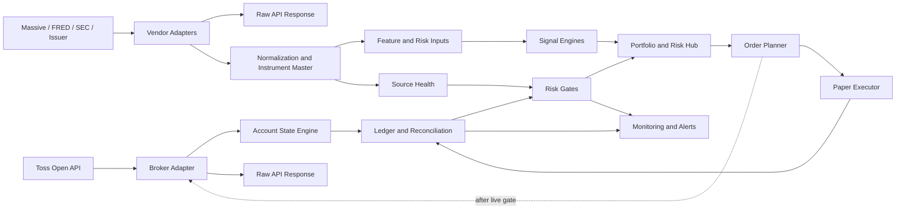

# System Architecture

## Boundary

이 시스템은 두 계층을 분리합니다.

- Execution truth: Toss Open API 응답, 내부 주문 로그, 체결 누적 snapshot, 계좌 장부
- Decision inputs: Toss 시장 데이터, Massive/FRED/SEC/issuer 등 외부 데이터, feature와 risk gate

외부 데이터가 아무리 좋아도 포지션, 현금, 주문 가능 금액, 체결 반영은 Toss와 내부 ledger를 기준으로 확정합니다.

## Layered Design

## Source Of Truth

| Domain | Source of Truth | Notes |
| --- | --- | --- |
| Account identity | Toss `accounts` | `accountSeq` is required for account/order APIs |
| Holdings and orders | Toss + internal replay | Internal ledger must reconcile to broker snapshots |
| Buying power | Toss `cashBuyingPower` as constraint | Not treated as cash balance |
| Cash estimate | Internal `cash_ledger` | Derived from executions, fees, tax, settlement policy |
| Market bars and quotes | Toss or external provider by strategy | Must carry source and timestamp metadata |
| Options chain and Greeks | External provider only | Research/risk input, not Toss live execution |
| Rates and carry hurdle | FRED/Treasury sources | Batch data, not intraday execution truth |
| SEC and issuer events | SEC EDGAR and issuer parser | Event gate, distribution filter, NAV/ROC support |

## Core Runtime Flow

1. Broker adapter gets Toss snapshots and stores raw responses.
2. Account state engine reconstructs cash, holdings, orders, fills, fees, taxes, and settlement.
3. External adapters normalize decision data into canonical symbols and UTC timestamps.
4. Source health gates stale, missing, or inconsistent data before signals are allowed.
5. Feature tables are populated before signal decisions.
6. Signal layer emits `ALLOW`, `REDUCE`, or `BLOCK`, never direct orders.
7. Portfolio/risk hub applies account, liquidity, data, rate-limit, and kill-switch gates.
8. Order planner creates a quantity-based or amount-based order plan with a new `clientOrderId`.
9. Paper/live adapter executes only after reconciliation and rate-limit checks pass.

## Runtime Modes

| Mode | Purpose | Live Orders |
| --- | --- | --- |
| `research` | historical research and feature validation | No |
| `simulation` | account replay and partial-fill simulation | No |
| `paper` | live signals with simulated orders | No |
| `semi_auto` | order proposals with manual approval | No |
| `micro_live_equity` | tiny Toss spot stock/ETF orders | Gate required |
| `live_equity` | calibrated Toss spot stock/ETF orders | Gate required |
| `research_options` | external options data only | No Toss live support |

## Design Constraints

- REST polling is the default because Toss does not provide a documented webhook/stream for orders.
- `clientOrderId` idempotency is enforced by the system, not left to the caller.
- Unknown broker enum values are stored and treated conservatively.
- Every account-bound table must carry `account_seq`; market/reference data stays account-neutral unless it becomes a portfolio event.
- `raw_api_response` records are immutable audit records; normalized tables can be rebuilt from them.
