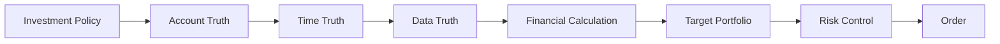
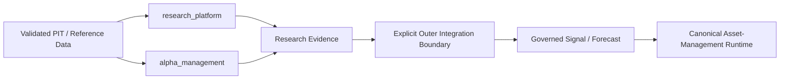

# System Architecture

이 문서는 현재 `toss-trading-core`의 상위 구조를 설명합니다. 과거 `toss_trading` Foundation/Paper runtime이나 독립 research application을 정상 실행 경로로 취급하지 않습니다. 권위 있는 compile-time dependency 규칙은 `src/asset_management/ARCHITECTURE.md`, runtime gate 순서는 `docs/architecture.md`를 함께 참조합니다.

## Canonical ownership

시스템은 세 역할을 명확히 분리합니다.

| Boundary | Role | Authority |
| --- | --- | --- |
| `asset_management` | account/data/time truth, calculations, portfolio, risk, decision, execution contracts | 유일한 production runtime boundary |
| `research_platform` | collection, immutable datasets, backtests, hypotheses, diagnostics, reporting | research/offline only |
| `alpha_management` | research DSL, transforms, quantitative templates, evaluation | research only |

보조 경계는 다음과 같습니다.

- `asset_management.toss`: Toss API contract와 read-only broker/provider adapter. 투자 판단 authority 없음.
- `asset_management.compatibility`: finalized historical Foundation evidence의 read/replay 전용 경계. runtime entry point 없음.
- `asset_management.orchestration`: core module을 조합하는 outer application shell. core가 orchestration을 역으로 import하지 않음.

## Compile-time dependency direction

투자 core의 dependency는 안쪽으로만 향합니다.

```text
execution
  -> decisions
    -> portfolio
      -> pricing / expectations / risk
        -> states
          -> features
            -> broker / account / ledger / data / quality
              -> time / config / reference
                -> domain
```

`replay`, `validation`, `orchestration`, `monitoring`, `reporting`, `cli`는 outer shell입니다. 이 계층은 core를 조합할 수 있지만 core module이 이들을 import해 권한이나 상태를 제조해서는 안 됩니다.

특히 다음을 금지합니다.

- feature가 order를 생성하는 것
- execution layer가 새 pricing/feature 계산을 수행해 decision을 바꾸는 것
- research package가 broker를 호출하거나 portfolio/risk policy를 우회하는 것
- compatibility reader가 옛 Foundation runtime을 복원하는 것

## Runtime evidence flow

모든 governed decision run은 아래 순서를 따릅니다.



각 단계는 같은 runtime run 안에서 immutable evidence identifier와 content hash를 기록합니다. 누락·stale·충돌·검증 불가 evidence가 있으면 해당 단계에서 중단합니다. 뒤 단계가 앞 단계의 evidence를 추정하거나 대체할 수 없습니다.

## Research flow

Research는 production runtime과 병렬인 두 번째 application이 아니라, 명시적인 outer integration boundary에 입력을 공급하는 내부 기능입니다.



Research score, ResearchRun receipt, backtest 성과, model hash는 그 자체로 production forecast나 target weight가 아닙니다. production에 반영되려면 별도의 Signal/Forecast/Portfolio/Risk 계약과 acceptance를 통과해야 합니다.

## Broker and account boundary

Toss는 외부 broker/account evidence의 중요한 source이지만, 응답 필드의 의미를 내부 회계나 투자 판단으로 임의 확장하지 않습니다.

- holdings/orders/buying-power 등은 Toss contract와 immutable raw evidence에 결속합니다.
- `cashBuyingPower`는 broker가 반환한 주문 제약값이며 내부 cash ledger 또는 accounting NAV와 동일한 값으로 간주하지 않습니다.
- account truth와 execution evidence는 research output보다 우선하며 research가 이를 덮어쓸 수 없습니다.
- broker-write authority는 현재 활성화되어 있지 않습니다.

## Supported runtime state

현재 지원되는 production runtime 시작 상태는 `READ_ONLY`입니다.

`research`, historical replay, diagnostics 등은 capability 또는 offline workflow이지 별도 production execution mode가 아닙니다. 과거 문서에 존재하던 `paper`, `semi_auto`, `micro_live_equity`, `live_equity` 등의 독립 runtime mode 표는 현재 canonical architecture를 설명하지 않으므로 더 이상 사용하지 않습니다.

Live trading은 `config/application.yaml`에서 비활성화되어 있으며 별도의 승인·검증 체계를 통과하기 전까지 broker-write path를 암묵적으로 복원하지 않습니다.

## Retired runtime and deployment surfaces

다음 경로는 canonical runtime에서 폐기되었습니다.

- `toss_trading` package runtime
- Foundation runner
- former Paper operation
- standalone research scheduler/application
- stock-recommendation service/timer
- 독립 Gmail/report/GCS delivery runtime

Repository에서 파일을 제거한 사실만으로 실제 VM/GCP 배포가 사라졌다고 간주하지 않습니다. 실제 unit, scheduler, alert policy, metric retirement는 `asset_management.cli.legacy_retirement`의 fail-closed inventory/apply 절차와 별도 운영 evidence로 검증해야 합니다.

## Current acceptance boundary

현재 architecture가 해결한 것은 **단일 runtime과 권한 경계**입니다. 다음 사항은 별도 acceptance work로 남습니다.

- 실제 host/cloud legacy retirement와 no-second-scheduler proof
- raw-return-to-factor-estimator lineage/replay
- real-data OOS와 Signal/Forecast acceptance
- production consumer cutover
- 어떤 live broker-write authority도 별도 승인 없이 생성되지 않았다는 최종 검증

따라서 CI 통과, artifact hash 일치 또는 documentation 정리는 operational/live acceptance와 동일하지 않습니다.
