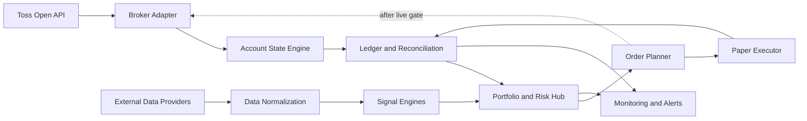

# 시스템 아키텍처

## Layered Design

## Toss API Layer

공식 Open API는 `https://openapi.tossinvest.com` 기반 REST API입니다. 인증은 OAuth2 Client Credentials Grant이며, 계좌/자산/주문 API는 `X-Tossinvest-Account` 헤더에 `accountSeq`를 전달합니다.

제공되는 핵심 기능:

- OAuth2 토큰 발급
- 국내/미국 주식 시세, 호가, 체결, 캔들, 상하한가
- 종목 기본 정보와 매수 유의사항
- 환율과 국내/미국 장 운영 시간
- 계좌 목록
- 국내/미국 주식 보유 현황
- 주문 생성, 정정, 취소
- 주문 목록과 주문 상세
- buying power, sellable quantity, commissions

문서상 제공되지 않는 기능:

- 옵션체인, Greeks, 옵션 주문
- 채권/T-bill 직접 보유 또는 담보 API
- margin requirement breakdown
- borrow rate, short availability
- webhook/websocket
- tax lot/cashflow 이벤트
- ETF NAV, premium/discount, ROC 구성

## Signal Layer

Toss live MVP에서 활성화 가능한 엔진:

- `EtfRelativeValueEngine`: 현물 ETF pair 후보 생성. short/borrow가 필요한 구조는 제외합니다.
- `DistributionFilterEngine`: 분배형 ETF의 과열, NAV premium, ROC 위험을 외부 데이터로 필터링합니다.

Toss 단독 live 범위 밖 엔진:

- `OptionCarryEngine`: 옵션 데이터와 옵션 주문 미지원.
- `TBillCollateralEngine`: 채권/T-bill 직접 자동화 미지원.

## Portfolio/Risk Hub

원시 신호를 비용, 세금, 유동성, buying power, 주문 가능 시간, rate limit, 공통 팩터 노출로 조정합니다. 최종 주문 후보는 이 허브를 통과해야 합니다.

## Execution Layer

실주문 경로는 공식 주문 API를 사용합니다.

- `POST /api/v1/orders`
- `POST /api/v1/orders/{orderId}/modify`
- `POST /api/v1/orders/{orderId}/cancel`
- `GET /api/v1/orders`
- `GET /api/v1/orders/{orderId}`

모든 주문 생성에는 `clientOrderId`를 강제합니다. 한번 사용한 `clientOrderId`는 Toss의 10분 멱등성 창이 지나도 내부에서 재사용하지 않습니다. 주문 상태는 REST 폴링으로 확인합니다.

`CANCEL_REJECTED`와 `REPLACE_REJECTED`는 terminal status가 아니라 review status입니다. 원주문을 다시 조회해 effective state를 확정해야 합니다.

## Account State Engine

계좌 상태 엔진은 브로커 응답과 내부 장부를 결합해 다음 값을 재계산합니다.

- `broker_cash_buying_power_constraint`
- `estimated_cash_balance`
- `pending_settlement_cash`
- `reserved_cash_open_orders`
- `available_cash`
- `net_liquidation_value`
- `risk_nav`
- `estimated_tax_reserve`

`broker_cash_buying_power_constraint`는 현금 잔고가 아니라 브로커가 반환한 매수 가능 제약값입니다. 내부 현금 장부와 별도로 저장합니다.

## Raw Snapshot Layer

Toss의 accounts, holdings, orders, buying power, commissions 응답은 정규화 전에 `raw_broker_snapshot`에 저장합니다. 운영 장애나 reconciliation 실패 시 원본 응답을 재생할 수 있어야 합니다.

## Rate Limit Layer

API group별 token bucket을 둡니다. `ORDER` group이 압박받을 때 신규 주문보다 주문 상태 확인과 취소를 우선합니다. 자세한 설계는 `docs/11_rate_limit_token_bucket.md`를 따릅니다.

## Default Runtime Modes

| Mode | Purpose | Live Orders |
| --- | --- | --- |
| `research` | 과거 데이터 검증과 백테스트 | No |
| `simulation` | 주문큐, 슬리피지, 부분체결 모의 | No |
| `paper` | 라이브 신호와 페이퍼 체결 | No |
| `semi_auto` | 주문 제안 생성, 사용자가 수동 실행 | No |
| `live_equity` | Toss 현물 주식/ETF 주문 | Gate required |
| `live_options` | 옵션 주문 | Not supported by Toss Open API docs |
