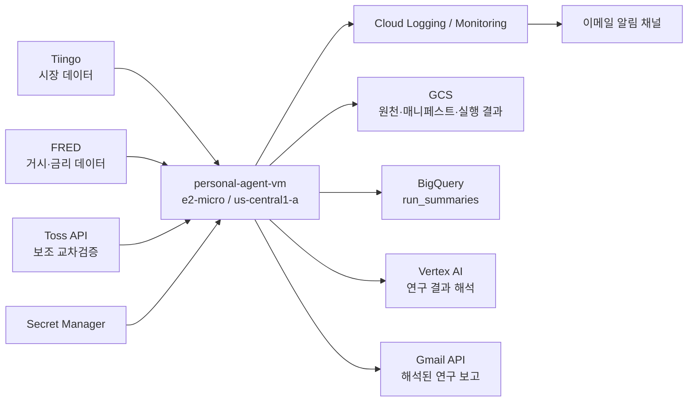
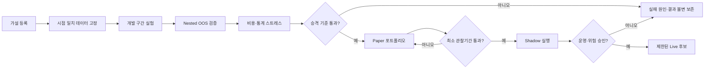

# GCP 운영·비용·연구 준비도 감사 및 운영 가이드

> 기준 시각: 2026-07-31 (Asia/Seoul)
> 대상 프로젝트: `toss-trading-core-lab`
> 문서 성격: 실제 클라우드 자원 감사, 적용 기록, 운영 runbook
> 주의: 4~7장은 2026-07-30 최초 감사 증거를 보존한다. 아래 “0. 적용 상태”가 현재 운영 상태의 권위 있는 요약이다.

## 0. 2026-07-31 적용 상태

권장 순서의 운영 안전장치와 검증 의미 교정은 실제 GCP와 코드에 적용했다.

| 항목 | 현재 상태 | 운영 의미 |
|---|---|---|
| VM 스냅샷 | `toss-runner-daily-snapshot`, 매일, 14일 보존 | OS·systemd·release 복구 지점 확보 |
| 연구 버킷 PAP | `enforced` | 조직 상속과 무관하게 공개 접근 방지 |
| 연구 버킷 IAM | runner는 `storage.objectCreator`만 보유, 16-worker create-only resumable 업로더 사용 | 기존 연구 객체 조회·삭제·덮어쓰기 금지 |
| GCS live 보존 | daily run 30일, weekly run 365일, 보고서는 최대 730일 | 고유 객체의 무한 증가 방지 |
| 예산 | 월 KRW 15,000, 50/80/100% 실제·100% 예측 알림 | 비용 조기 인지, 자동 서비스 중단은 아님 |
| Billing Export | `toss_billing_export`, standard usage cost | 실제 서비스별 비용 분석 가능 |
| BigQuery | 전략 상태·prospective 진행·benchmark 열 추가 | 산출물과 승격 상태를 별도 조회 |
| 로그 지표 | research 지표 24개 | 실패·품질·메일·AI 가설·후보평가·승격·주간 정체 계측 |
| 연구 알림 | research 정책 15개 | 메일·AI 연구·주간·disk·memory·Ops Agent 포함 |
| daily 일정 | 매일 23:30 UTC + 최대 15분 지연 | 하루 2회 중복 수집 제거 |
| weekly 일정 | 일요일 03:30 UTC + 최대 15분 지연 | 전체 재대사와 전략 산출물 생성 |
| 로컬 prune | 월요일 04:30 UTC | 검증 완료 daily 14일, weekly 90일, `previous` 롤백 링크 포함 release 3개 유지 |
| VM release | content-addressed `current`와 `previous` symlink | 의미 검사가 강화된 코드와 마지막 성공 주간 run 코드를 분리 보호; 실제 값은 `readlink -f`로 확인 |
| 전략 상태 | artifact/methodology/benchmark/promotion 분리 | 파일 생성만으로 검증 완료 처리 금지 |
| 승격용 OOS | 2026-08-03 시작, 최소 126거래일 prospective | 최소 표본 전 부분 성과 비공개·승격 차단 |
| 실험 lineage | 실제 읽은 Parquet와 silver manifest 일대일 대응 | 카탈로그 전체를 잘못 참조하던 문제 제거 |
| AI 후보 연구 | 누적 3개, 역사 관문 통과 0개 | 신규 가설은 불변 등록, 탈락도 보존, 같은 주 추가 생성 차단 |

최종 형식 검증 주간 실행 `weekly-20260731T113630Z-58bd289453aa`은
Toss·Tiingo·FRED 모두 `collected`, 품질 오류 0행, GCS 업로드, BigQuery
`inserted`, Vertex AI 해석, Gmail `sent`까지 완주했다. 전략 산출물은
`available`이지만 prospective OOS는 0/126 `collecting`이며, 부분 표본의
headline 성과는 `null`로 숨겼다. 126거래일과 SPY gate를 통과하기 전까지
promotion은 `blocked`다.

Vertex AI가 가격 성과를 보지 않고 제안한 정책 제한형 후보 3개도 같은 실행에서
평가했다. 주당 한도 재사용은 `weekly_limit_reached`로 차단됐고 신규 후보는
0개였다. 기존 후보 3개의 SPY 대비 연율 평균 초과수익은 각각 -13.83%,
-5.48%, -5.82%, Bonferroni 보정 p-value는 모두 1.000이었다. 비용 2배
스트레스도 모두 음수여서 역사 관문 통과와 prospective protocol 등록은 0개다.
Gmail의 권위 있는 사실 구역에 이 수치와 실패 관문이 후보별로 포함되는 것을
발송 입력으로 재구성해 확인했다.

운영자가 매일 대시보드를 확인할 필요는 없다. 정상 연구 해석은 Gmail로
받고, 실행 실패·메일 실패·heartbeat·자원 부족은 독립적인 Cloud Monitoring
이메일 채널로 받는다.

## 1. 결론

현재 GCP 구조는 개인 연구용 단일 워커로서 대체로 올바르고 비용 효율적이다. `e2-micro`, 표준 영구 디스크, `us-central1` 단일 리전, systemd 타이머, IAP SSH, Secret Manager, BigQuery 소형 보고 테이블을 사용한 판단은 현재 규모에 적합하다. 지금 Cloud Run, GKE 또는 더 큰 VM으로 이전할 근거는 없다.

현재는 가설 생성·도전자 비교·다중검정·전향 protocol까지 갖춘 제한형 지속 연구
플랫폼이다. 다만 이를 “실거래 승격까지 완성된 플랫폼”이라고 부를 수는 없다.

1. 실제 paper 주문·체결·부분체결·수수료 대사 인프라가 아직 없다.
2. paper 이후 shadow 증거의 최소 기간과 거래 횟수가 아직 사전등록되지 않았다.
3. corporate action·ticker 변경·상장폐지의 point-in-time 독립 검증이 더 필요하다.
4. 현재 AI 후보는 안전한 dual-momentum DSL 한 종류에 한정된다. 전략군 확장은
   기존 관문을 약화하지 않는 별도 정책과 검증기를 먼저 만들어야 한다.

따라서 현재 운영 판정은 다음과 같다.

| 영역 | 현재 판정 | 핵심 조치 |
|---|---|---|
| 컴퓨팅 크기 | 적정 | `e2-micro` 유지, 증설 금지 |
| 네트워크 구조 | 적정 | Toss 허용목록용 고정 IP 유지 |
| 비용 효율 | 대체로 양호 | 예산·결제 내보내기와 Vertex 토큰 계측 추가 |
| 보안 | 기본선 양호 | GCS 공개 액세스 방지 강제, IAM 축소, 역할 분리 |
| 재해 복구 | 미흡 | 디스크 스냅샷 일정과 복구 훈련 추가 |
| 보존 정책 | 미흡 | 로컬/GCS 실행·릴리스별 수명주기 정의 |
| 모니터링 | 부분 충족 | 주간 연구·메일·Vertex·디스크·에이전트 경보 추가 |
| 전략 연구 방법론 | 연구 단계 충족 | AI 후보는 252일/12회 전향 관찰, 이후 paper 증거 필요 |
| 최신 전략 승격 | **차단** | 벤치마크 미달 및 방법론 결손 해결 전 paper/live 금지 |

## 2. 점검 범위와 증거

이번 판단은 문서의 계획만 읽은 결과가 아니다. 다음 실제 상태를 서로 대조했다.

- GCP 프로젝트의 VM, 디스크, IP, 방화벽, IAM, Secret Manager, GCS, BigQuery, Cloud Build, Logging, Monitoring
- VM의 실제 메모리·디스크·프로세스·systemd 타이머·실행 결과 보존량
- 구조화 로그에 남은 일별·주별 연구 실행 이력
- 최신 전체 연구 실험 JSON과 벤치마크 결과
- 연구 실행기, 백테스트, 보고, 데이터 계약, 테스트 코드
- 현재 저장소의 배포·운영·연구 문서와 실제 배포 상태의 차이

최초 감사 시점에는 결제 내역과 예산을 검증하지 못했다. 이후 월 KRW 15,000
예산과 표준 Billing Export를 구성했다. 예산은 지출을 자동 차단하지 않으며,
실제 비용은 `toss_billing_export` 데이터가 적재된 뒤 서비스·SKU별로 확인한다.

## 3. 현재 아키텍처



이 구조에서 데이터 수집·연구·보고가 한 VM에 집중되어 있다. 개인 연구 규모에서는 단순성과 비용 면에서 장점이 크다. 다만 하나의 VM과 하나의 서비스 계정이 공통 장애 지점이므로 스냅샷, 불변 산출물, 역할 분리가 보완되어야 한다.

## 4. 실제 GCP 자원 현황

### 4.1 컴퓨팅과 네트워크

| 항목 | 실제 상태 | 판단 |
|---|---|---|
| VM | `personal-agent-vm`, `RUNNING` | 단일 연구 워커로 적합 |
| 리전/존 | `us-central1-a` | 데이터·버킷·BigQuery와 가까워 적합 |
| 머신 | `e2-micro` | 현재 사용량에 충분 |
| 부팅 디스크 | 30 GB `pd-standard` | 무료 등급 조건과 맞고 현재 충분 |
| 외부 IP | 예약된 고정 IPv4, Premium tier | Toss 서버 허용목록 때문에 유지 필요 |
| SSH | IAP 범위 `35.235.240.0/20`만 허용 | 양호 |
| 공개 SSH/RDP | 기본 공개 규칙 비활성 | 양호 |
| Shielded VM | Secure Boot, vTPM, 무결성 모니터링 활성 | 양호 |
| 삭제 방지 | VM 삭제 보호 활성, 부팅 디스크 자동 삭제 비활성 | 운영 사고 방지에 유리 |
| 가용성 | 자동 재시작·라이브 마이그레이션 | 단일 VM 기준 적절 |

VM의 실제 사용량은 다음과 같았다.

| 지표 | 관측값 | 해석 |
|---|---:|---|
| 메모리 | 총 955 MB, 사용 약 436 MB, 가용 약 518 MB | 증설 근거 없음 |
| 스왑 | 없음 | 현재는 문제 없으나 메모리 경보 필요 |
| 디스크 | 30 GB 중 약 7.7 GB 사용, 약 28% | 즉시 증설 불필요 |
| 시스템 부하 | 0.05 / 0.12 / 0.60 | CPU 병목 근거 없음 |
| Ops Agent 메모리 | 관련 프로세스 합계 약 110 MB | 작은 VM에서는 계측 오버헤드가 의미 있으나 허용 범위 |

권장 판단:

- VM을 키우지 않는다.
- 현재 규모에서 Cloud NAT를 추가하지 않는다. 단일 VM의 고정 송신 IP를 위해 NAT Gateway를 쓰면 구조와 비용만 증가한다.
- Cloud Run/GKE로 이전하지 않는다. Toss 고정 송신 IP, 로컬 연구 상태, systemd 기반 배치라는 현재 요구에 VM이 더 단순하다.
- 고정 IP가 필요하므로 단순 비용 절감을 위해 VM을 매일 중지하지 않는다. 중지 시 유휴 외부 IP 비용과 운영 복잡성이 커질 수 있다.

### 4.2 로컬 저장 공간

| 경로 성격 | 실제 크기/개수 | 문제 |
|---|---:|---|
| 연구 실행 결과 | 약 403 MB, 20개 실행 디렉터리 | 보존 상한 없음 |
| 불변 릴리스 | 약 2.0 GB, 16개 릴리스 | 중복 배포 누적 |
| 런타임 상태 | 약 35 MB | 현재 작음 |
| systemd journal | 약 226 MB | 작은 VM에서 상한 필요 |

현재 디스크 부족은 아니지만 증가 원인은 컴퓨팅이 아니라 릴리스와 실행 결과의 중복 보존이다. VM 증설보다 먼저 보존 정책을 적용해야 한다.

권장 로컬 보존 기준:

- 릴리스: 현재 릴리스 + 직전 정상 릴리스 2개
- 성공한 일별 실행: 최근 7일
- 성공한 주별 전체 실행: 최근 4회
- 실패 실행: 원인 조사에 필요한 로그·매니페스트만 30일
- journal: 최대 256 MB를 시작점으로 설정하고 로그 유실 여부 관찰
- 삭제 전 GCS 업로드 성공, 객체 해시, BigQuery 요약 기록을 모두 확인

### 4.3 GCS

| 버킷 | 실제 상태 | 실제 크기 | 판단 |
|---|---|---:|---|
| Foundation 백업 | 버전 관리, 30일 soft delete, PAP 강제 | 약 26 MB | 보호는 좋으나 고유 백업 무기한 증가 |
| 연구 데이터 | 버전 관리, 7일 soft delete, 비현재 버전 90일 삭제 | 약 168 MB | 현재 작지만 live 고유 객체는 삭제되지 않음 |
| Cloud Build 버킷 | `US` 멀티리전 | 소형 | 수동 빌드 임시 산출물 용도 |

좋은 점:

- Uniform bucket-level access가 활성화되어 있다.
- 공개 사용자에게 부여된 버킷 권한은 관측되지 않았다.
- 버전 관리와 soft delete가 있어 실수 삭제 복구 여지가 있다.
- 주요 데이터와 컴퓨팅이 `us-central1`에 모여 있다.

개선할 점:

- 연구 버킷의 Public Access Prevention은 `inherited` 상태다. 조직 정책에 우연히 의존하지 않도록 버킷에서 `enforced`로 고정한다.
- 현재 수명주기는 “비현재 버전”만 정리한다. 실행 ID마다 새 경로를 쓰는 live 객체에는 적용되지 않으므로 고유 일별 실행과 Foundation 백업이 계속 증가한다.
- 버전 관리와 soft delete를 동시에 사용할 때 보존 비용이 중복될 수 있다. 복구 요구를 기준으로 각 계층의 기간을 명시한다.

권장 GCS 보존 정책:

| 데이터 종류 | 권장 보존 |
|---|---|
| 일별 원천/중간 산출물 | 90일 후 삭제 또는 저비용 클래스로 전환 |
| 주별 검증 원천 데이터 | 1년 |
| 실험 매니페스트·해시·최종 지표 | 최소 3년 |
| 실패 실험의 가설·설정·요약 | 최소 1년 |
| Foundation 6시간 백업 | 35일 |
| 월말 Foundation 체크포인트 | 1년 |

데이터 제공자의 재배포·장기 보관 약관을 먼저 확인한 뒤 기간을 확정해야 한다.

### 4.4 BigQuery

실제 보고 데이터셋은 `toss_research_reporting`, 테이블은 `run_summaries`, 뷰는 `latest_run_summaries`다.

| 항목 | 실제 상태 | 판단 |
|---|---|---|
| 행 수 | 11 | 매우 작음 |
| 논리 크기 | 약 4.4 KB | 비용상 무시 가능한 수준 |
| 파티션 | `verified_at` 일 단위 | 현재 쿼리 특성에 적절 |
| 클러스터 | `mode`, `strategy_state` | 현재 보고 필터에 적절 |
| 기본 만료 | 없음 | 요약 이력에는 허용 가능 |
| runner 권한 | 데이터셋 Writer | 쓰기 목적에 맞음 |

현재 BigQuery 최적화 작업은 우선순위가 낮다. 다만 다음을 추가하면 운영성이 좋아진다.

- 모든 대시보드 쿼리에 날짜 조건을 강제한다.
- 실험별 Vertex 입력·출력 토큰, 공급자 호출 수, 처리 시간, 비용 추정치를 열로 추가한다.
- 결제 내보내기를 별도 데이터셋에 활성화하고 연구 실행 ID와 비용을 연결한다.
- 데이터셋 Writer보다 더 좁은 커스텀 역할이 필요한지는 실제 쿼리 패턴이 안정된 뒤 검토한다.

### 4.5 Secret Manager와 IAM

실제 Secret Manager에는 Tiingo, FRED, Toss 인증 정보, Gmail OAuth 정보 등 10개의 시크릿이 있고 자동 복제를 사용한다. runner 서비스 계정에는 각 시크릿별 accessor가 부여되어 있으며 사용자 관리형 서비스 계정 키 파일은 없다. 이 두 선택은 적절하다.

남은 문제:

- 시크릿에 만료·회전 일정 메타데이터가 없다.
- runner가 연구 객체 버킷에서 `storage.objectAdmin`을 보유하여 업로드뿐 아니라 삭제도 가능하다.
- Foundation과 연구가 같은 서비스 계정·OS 사용자·VM을 공유한다.
- 연구 프로세스가 거래 실행에 필요하지 않은 Toss client ID/secret까지 읽을 수 있다.

권장 권한 경계:

| 주체 | 필요한 권한 |
|---|---|
| `research-runner` | 시장 데이터 시크릿 읽기, 연구 버킷 생성/조회, BigQuery 요약 추가, 로그/메트릭 기록 |
| `foundation-runner` | Foundation 전용 시크릿, Foundation 백업 생성, 상태 점검 |
| `retention-cleaner` | 정해진 접두사와 기간에 한해 객체 삭제 |
| `deployer` | 릴리스 업로드·서비스 전환, 연구 실행 권한 없음 |
| 운영자 | IAP SSH, 감사 조회, 비상 복구 |

즉시 권장:

1. 버킷 삭제 권한을 일상 runner에서 제거하고 업로드·조회 역할과 정리 역할을 분리한다.
2. 연구 코드에서 거래 실행용 시크릿을 로드하지 않도록 한다.
3. 각 시크릿에 소유자, 발급일, 마지막 검증일, 다음 검토일을 기록한다.
4. 회전 알림은 자동 회전과 다르므로, 공급자별 실제 재발급·검증 절차를 runbook에 둔다.
5. paper/live 단계 전에 연구 워커와 거래 실행기의 서비스 계정과 런타임을 분리한다.

### 4.6 백업과 재해 복구

Foundation GCS 백업은 존재하지만 Compute Engine 디스크 스냅샷과 스냅샷 스케줄은 하나도 없다. GCS 백업만으로는 Ubuntu 패키지, systemd unit, Ops Agent, 배포 링크, 파일 권한을 빠르게 복원할 수 없다.

권장 복구 계층:

1. 데이터 복구: GCS의 불변 원천 데이터·매니페스트·결과
2. 상태 복구: Foundation 백업
3. 서버 복구: 매일 디스크 스냅샷 7개와 주간 스냅샷 4개
4. 재현 복구: 저장소의 배포 스크립트와 고정된 의존성

스냅샷을 추가한 뒤 반드시 비운영 이름의 임시 VM으로 분기 복원 시험을 해야 한다. “스냅샷 존재”는 “복구 가능”과 같지 않다.

### 4.7 Cloud Build와 배포

Cloud Build 트리거는 없고, 2026-07-27에 실행된 수동 빌드 15회 중 8회 성공, 7회 실패가 관측되었다. 구축 기간의 시행착오가 포함되므로 장기 실패율로 해석하면 안 되지만, 배포 재현성이 아직 안정적이라고 증명할 수도 없다.

권장:

- 빌드 입력에 커밋 SHA와 파일 해시를 기록한다.
- 배포 산출물을 한 번 만들고 동일 산출물을 승격한다.
- 외부 builder 이미지는 태그가 아니라 digest로 고정한다.
- 배포 전 `gcloud meta list-files-for-upload` 결과에 시크릿·런타임 DB·로그가 없는지 자동 검사한다.
- 현재 `.gcloudignore` 결과에서 실제 비밀 유출 증거는 없었다. 다만 `.env*`, OAuth JSON, `*.sqlite`, `*.jsonl`, `*.log`를 명시적으로 제외해 미래 변경에 대비한다.
- 수동 빌드가 빈번해지면 Artifact Registry를 도입하되, 현재 1대 VM 규모에서 미리 복잡도를 늘리지는 않는다.

## 5. 비용 효율 감사

### 5.1 관측 가능한 비용 구조

| 자원 | 사용량/구성 | 비용 판단 |
|---|---|---|
| `e2-micro` | `us-central1`, 상시 1대 | 계정·월간 공유 사용량이 무료 등급 조건을 만족하면 무료 가능 |
| 표준 PD | 30 GB | 무료 등급의 30 GB-month 범위와 일치 |
| 사용 중 외부 IPv4 | 상시 1개 | 약 `$0.005/시간`, 730시간 기준 약 `$3.65/월` |
| GCS | 합계 약 194 MB + build | 현재 매우 작지만 버전/soft delete/무기한 live 객체가 증가 요인 |
| BigQuery | 4.4 KB, 11행 | 현재 사실상 무시 가능한 수준 |
| Cloud Build | 15회 수동 빌드 | 현재 무료 build-minute 범위보다 훨씬 작을 가능성이 큼 |
| Cloud Logging | 기본 버킷 30일 | 실제 수집량을 결제 내보내기로 확인해야 하나 현재 규모는 작음 |
| Vertex AI | 일별 2회 + 주별 1회 해석 | 토큰 계측이 없어 정확한 비용 검증 불가 |

가장 명확한 고정비는 외부 IPv4다. 그러나 Toss API가 송신 IP 허용목록을 요구하므로 이 비용은 현재 설계에서 정당화된다. 이를 없애기 위해 Cloud NAT나 별도 프록시를 도입하면 오히려 더 비싸고 복잡해질 가능성이 높다.

### 5.2 비용 개선 우선순위

1. **예산 확인 가능성 확보**
   월 예산을 만들고 50%, 80%, 100% 실사용 및 예상 지출 알림을 설정한다. 일반 예산 알림은 서비스를 자동 중단하지 않는다는 점을 명시한다.
2. **결제 내보내기 활성화**
   BigQuery billing export로 SKU별 실제 비용을 확인한다. 이 작업 전에는 “무료”를 확정적으로 말하지 않는다.
3. **Vertex 토큰 계측**
   실행별 모델명, input/output token, 호출 횟수, 재시도 횟수를 `run_summaries`에 기록한다.
4. **중복 일별 실행 축소**
   현재 “daily”가 12시간마다 실행된다. 시장 데이터가 안정된 뒤 하루 1회로 줄이고, 주간 실행에서 전체 재검증을 한다.
5. **보존 정책 적용**
   VM 크기를 줄이거나 스토리지를 늘리기 전에 릴리스·실행·백업 중복부터 제거한다.
6. **사용 API 정리**
   Artifact Registry, Dataform, Dataplex 등 사용 근거가 없는 API는 의존성을 확인한 뒤 비활성화한다. 단순히 목록을 줄이기 위해 즉시 끄지는 않는다.

개인 연구 프로젝트의 초기 예산 경보는 월 `$10` 수준에서 시작해 실제 1개월 청구서를 본 뒤 조정할 수 있다. 이것은 비용 상한이 아니라 이상 징후 조기 탐지 기준이다.

## 6. 자동화·신뢰성·모니터링 감사

### 6.1 실제 일정

| 작업 | 실제 일정 | 판단 |
|---|---|---|
| Foundation 점검/백업 | 6시간마다 | 인증·기반 상태 감시에는 합리적 |
| 일별 연구 | 12시간마다 | 이름과 실제 의미가 다르고 중복 가능 |
| 주별 전체 연구 | 매주 일요일 03:30 UTC + jitter | 전체 재검증 일정으로 적절 |

Cloud Scheduler API는 비활성이고 systemd 타이머를 사용한다. 한 VM에서 실행하는 현재 구조에는 합리적이며 Cloud Scheduler를 도입할 이유가 없다.

구조화 로그에서 관측된 구축 기간 실행 이력:

| 유형 | 성공 | 실패 | 시간 |
|---|---:|---:|---|
| 일별 | 11 | 4 | 중앙값 약 1.2분, 최대 약 3.5분 |
| 주별 | 2 | 3 | 중앙값 약 15.3분, 최대 약 30.6분 |

이 표에는 배포·디버깅 기간이 포함되어 있다. 최신 전체 실행 성공은 확인됐지만 장기 SLO가 입증된 것은 아니다. 앞으로 최근 30개 예약 실행만 별도 집계해야 한다.

### 6.2 실제 모니터링

관측된 상태:

- 연구 관련 로그 기반 메트릭 18개
- 전체 알림 정책 11개
- 연구 경보: 락 경합, 데이터 검증 실패, 자동화 실패, 일별 heartbeat, 백업 heartbeat
- 이메일 알림 채널 1개
- 주 운영 대시보드 1개와 이름이 불명확한 오래된 대시보드 1개
- `_Default` 로그 보존 30일, `_Required` 400일

배포 상태와 저장소의 다음 설정 사이에 drift가 있다. 저장소에는 Vertex 해석 실패 메트릭/경보가 추가되어 있지만 실제 프로젝트에는 아직 반영되지 않은 항목이 있다.

추가할 경보:

| 우선순위 | 경보 | 시작 기준 예시 |
|---|---|---|
| P0 | 주별 전체 연구 heartbeat 누락 | 8일 동안 성공 없음 |
| P0 | 연구 방법론/승격 판정 실패 | 최신 전체 실행에서 `promotion_state != eligible` |
| P0 | Gmail 보고 실패 | 성공 실행 후 메일 전송 실패 1회 |
| P0 | Vertex 해석 실패 | fallback 발생 또는 해석 누락 1회 |
| P1 | 디스크 사용량 | 70% 경고, 85% 심각 |
| P1 | 메모리 압박/OOM | 15분 평균 85% 또는 OOM 로그 |
| P1 | Ops Agent 중단 | 메트릭/로그 수집 공백 |
| P1 | API 인증 실패 | 제공자별 연속 실패 2회 |
| P2 | 연구 신선도 | 최신 성공 데이터가 예상 거래일보다 오래됨 |

모든 자동 메일은 고정 템플릿만 보내서는 안 된다. 메일 본문은 실제 실험 지표, 이전 실행과의 변화, 실패 원인, 승격 판정, 다음 연구 행동을 바탕으로 생성하고, 모델 해석과 기계 검증 사실을 구분해야 한다.

## 7. 전략 연구 준비도 감사

### 7.1 최신 실제 연구 결과

최신 전체 실행의 기준 전략은 `broad_etf_dual_momentum_v1`이다.

| 항목 | 전략 | SPY 벤치마크 |
|---|---:|---:|
| 공통 검증 기간 | 2020-05-28 ~ 2026-07-29 | 동일 |
| Walk-forward fold | 8 | 비교 대상 |
| CAGR | 11.51% | 17.01% |
| Sharpe | 0.673 | 1.011 |
| 최대 낙폭 | -26.40% | -24.50% |

전략은 수익률, 위험조정 성과, 낙폭에서 모두 SPY보다 낫지 않았다. 따라서 현재 전략 상태는 다음과 같이 기록해야 한다.

```text
artifact_state   = available
methodology_state = incomplete
benchmark_state  = failed
promotion_state  = blocked
```

“실행 성공”과 “전략 승격 가능”은 완전히 다른 상태다. 현재 결과를 paper 또는 live 전략으로 승격해서는 안 된다.

### 7.2 P0: 먼저 해결해야 하는 연구 결손

#### A. 검증 상태의 의미가 잘못되어 있음

`src/toss_trading/research/reporting.py`의 전략 스냅샷 검증은 파일, revision, 매니페스트, total-return 플래그, 유한한 지표는 확인하지만 walk-forward fold와 벤치마크 성과의 존재·통과를 필수로 보지 않는다. `scripts/run_research_automation_gcp.sh`도 실험 파일이 있으면 `research_strategy_validation_ok`를 기록한다.

결과적으로 빈 리밸런싱 목록, 단일 equity point, fold·benchmark가 없는 산출물도 “available”이 될 수 있는 테스트가 존재한다.

고칠 방향:

- `artifact_state`, `data_quality_state`, `methodology_state`, `benchmark_state`, `promotion_state`를 분리한다.
- 자동화 성공은 실행·저장 성공만 뜻하도록 한다.
- 승격 판정은 독립된 검증기가 fold, 벤치마크, 비용 스트레스, 통계 기준을 모두 확인한 뒤 생성한다.
- 메일 제목과 대시보드에 “실행 성공”을 “전략 검증 성공”으로 표현하지 않는다.

#### B. 현재 walk-forward가 진짜 표본외 검증이 아님

`src/toss_trading/research/backtest.py`의 walk-forward는 이미 만들어진 하나의 수익률 시계열을 504일 train/126일 test 구간으로 나눈다. train 구간이 모델 적합, 파라미터 선택, 종목 선택에 사용되지 않고, 헤드라인 지표는 fold의 표본외 결과가 아니라 전체 기간 결과다.

고칠 방향:

1. 가설 등록 시점에 우주, 신호, 파라미터 범위, 성공 기준을 고정한다.
2. discovery, development, untouched holdout 기간을 분리한다.
3. 파라미터를 고르면 각 외부 fold 안에서만 내부 검증을 수행하는 nested walk-forward를 사용한다.
4. 최종 지표는 이어 붙인 표본외 수익률로 계산한다.
5. untouched holdout은 최종 후보에게 한 번만 공개한다.

#### C. 시점 일치(point-in-time) 종목 우주가 없음

`data/universe.csv`는 현재 살아남은 ETF 목록이고, `data/instrument_master.csv`의 `effective_from`은 모두 2026-01-01 형태의 임시값이다. SGOV를 공통 교집합에 포함하면서 전체 검증 기간도 2020년 이후로 잘렸다.

이 상태에서는 생존 편향을 통제할 수 없고 2008, 2011, 2018 같은 중요한 위기 국면을 검증하지 못한다.

고칠 방향:

- 실제 상장일, 상장폐지일, 티커 변경, 합병, 분배금, split 이력을 저장한다.
- 각 리밸런싱 시점에 실제로 거래 가능했던 우주만 구성한다.
- 현금 대용 자산 때문에 역사가 잘리지 않도록 FRED DTB3 기반 합성 cash/risk-free 시계열을 사용한다.
- 짧은 역사의 ETF가 필요한 경우 동일 노출의 장기 지수/프록시를 사전에 정의하고 프록시 사용 기간을 표시한다.

#### D. 데이터 파일과 매니페스트가 강하게 결합되지 않음

CLI는 임의 Parquet 경로를 읽고 매니페스트 ID는 별도로 수집한다. 보고 검증은 그 ID가 존재하는지만 확인한다. 따라서 다른 파일의 매니페스트를 잘못 연결해도 통과할 수 있다.

고칠 방향:

- 연구 입력은 파일 경로가 아니라 manifest ID만 받는다.
- 매니페스트가 정확한 객체 URI, SHA-256, 행 수, 스키마, 조정 방식, 제공자, 수집 시각을 가리키게 한다.
- 실행기는 해시를 검증한 뒤에만 데이터를 연다.
- 결과에는 사용한 모든 manifest ID와 코드 revision을 불변 기록한다.

### 7.3 P1: 전략 선택 전에 필요한 연구 결손

#### 벤치마크

현재 실험 산출물은 사실상 SPY만 저장한다. equal-weight와 60/40 구현은 전략과 다른 조건의 비용 없는 일별 리밸런싱이라 공정한 비교가 아니다.

모든 후보에 다음을 같은 거래 달력, 비용, 리밸런싱 규칙으로 적용한다.

- SPY buy-and-hold
- 현금/단기금리
- equal-weight
- 60/40
- 전략 목적과 동일한 위험 예산의 단순 기준선
- fold별 초과수익, information ratio, downside capture

#### 거래비용과 실행 가능성

이 감사에서 지적한 고정 10/2 bps 경로는 P1 v3에서 제거했다. 현재 미국 수수료
schedule과 주문금액별 slippage tier가 담긴 sanitized calibration이 필수다. 다만 세금,
실측 bid-ask spread, 시장 충격, 급변일 체결 실패는 아직 모델에 포함되지 않는다.

최소 스트레스 시나리오:

- 기본 비용
- 비용 2배
- 비용 5배
- 리밸런싱 1거래일 지연
- 종가 신호 후 다음 거래일 시가/보수적 VWAP 체결
- 일부 자산 거래 불가 및 stale price

#### 통계적 불확실성과 다중검정

현재 지표는 점 추정치다. 신뢰구간, bootstrap, 다수 전략을 시험한 선택 편향 통제가 없다.

추가할 항목:

- block bootstrap 기반 CAGR, Sharpe, max drawdown 신뢰구간
- fold별 성과 분산과 최악 fold
- Probabilistic/Deflated Sharpe Ratio
- 시험한 가설 수와 폐기된 가설을 포함한 연구 원장
- 후보 선택 후 holdout 재사용 금지

#### FRED 활용

FRED 6개 시리즈를 8개 창으로 수집하는 증거는 있지만 현재 전략 신호에는 사용되지 않는다. 설정에 cash hurdle이 있어도 absolute momentum 최소값과 Sharpe의 무위험 수익률은 사실상 0에 가깝다.

우선 사용 순서:

1. DTB3를 cash hurdle과 Sharpe의 시점별 무위험 수익률로 사용
2. 빈티지 시점이 중요한 거시 데이터는 ALFRED/as-of join 사용
3. 거시 변수는 처음부터 최적화 신호로 넣지 말고 국면별 진단에 먼저 사용
4. 유효성이 반복 확인된 뒤 사전 등록된 규칙으로만 신호에 포함

### 7.4 P1: “끊임없는 연구”를 위한 실제 루프

현재 주간 자동화는 동일한 고정 전략을 다시 실행한다. 데이터가 계속 들어오는 것과 연구가 계속 발전하는 것은 다르다.

권장 연구 상태 머신:



가설 원장 필수 필드:

- hypothesis ID, 작성 시각, 경제적 근거
- 변경하는 신호/우주/파라미터와 기준 전략 차이
- 사용할 데이터 manifest와 금지된 미래 데이터
- 사전 정의 성공·실패 기준
- 시험 횟수와 관련 가설군
- 결과, 통계적 불확실성, 비용 스트레스
- 폐기/보류/승격 이유

자동화는 매주 무작위로 전략을 생성해서는 안 된다. 승인된 가설 대기열에서 하나씩 실행하고, 실패도 삭제하지 않으며, champion과 challenger를 같은 조건에서 비교해야 한다.

### 7.5 paper/live 진입 기준

저장소 문서에는 2주와 60거래일이 혼재한다. 더 엄격한 기준으로 통일한다.

최소 권장 기준:

- 독립 holdout 통과
- 비용 2배에서도 핵심 우위 유지
- 데이터·코드·환경 재현 가능
- 60거래일 이상 persistent paper 실행
- 그 후 별도 shadow 기간에서 주문 생성·리스크·알림 검증
- 연구와 거래 실행 서비스 계정 분리
- kill switch, 최대 포지션, 손실 한도, 주문 중복 방지 검증
- 사람이 승인하기 전 자동 live 승격 금지

현재 전략은 이 단계에 진입할 수 없다.

## 8. 권장 실행 순서

### 0단계: 지금 유지할 것

- `e2-micro`, 30 GB 표준 PD, `us-central1`, 고정 IP, IAP SSH 유지
- systemd 타이머 유지
- Secret Manager와 불변 실행 ID 구조 유지
- 현재 전략의 live/paper 승격 차단

### 1단계: 1~3일, 손실 방지와 의미 교정

1. 일별 디스크 스냅샷 일정과 복구 시험 계획 추가
2. 연구 버킷 PAP를 `enforced`로 변경
3. `artifact/methodology/benchmark/promotion` 상태 분리
4. 벤치마크 미달 시 `promotion_state=blocked` 강제
5. 주간 heartbeat, Gmail 실패, Vertex 해석 실패 경보 배포
6. 결제 예산과 BigQuery billing export 존재 여부를 콘솔에서 확인·설정

### 2단계: 1주, 비용·운영 안정화

1. 일별 연구를 데이터 확정 후 하루 1회로 축소
2. 로컬 릴리스·실행 결과 보존 상한 적용
3. GCS의 live 고유 객체 수명주기 적용
4. journal 크기 상한과 디스크 경보 적용
5. 사용하지 않는 오래된 대시보드 정리
6. runner의 객체 삭제 권한을 retention 전용 주체로 분리
7. `.gcloudignore` 민감 패턴과 업로드 목록 자동 검사 추가

### 3단계: 2~4주, 연구 신뢰성 구축

1. manifest ID 기반 입력과 해시 검증
2. point-in-time instrument master 구축
3. DTB3 기반 현금·무위험 수익률 반영
4. nested walk-forward와 untouched holdout 도입
5. 동일 조건 다중 벤치마크와 비용 스트레스 도입
6. bootstrap·Deflated Sharpe·가설 원장 도입
7. 실행별 API 호출·Vertex 토큰·비용 계측

### 4단계: 이후, 지속 연구와 paper

1. champion/challenger 연구 대기열 운영
2. 실패 실험까지 불변 보존
3. 사전 등록된 승격 기준 자동 판정
4. 통과한 후보만 60거래일 persistent paper
5. 별도 서비스 계정·런타임에서 shadow 실행
6. 사람의 명시적 승인 후에만 제한된 live 검토

## 9. 운영 Runbook

### 9.1 기본 변수

운영자 PC PowerShell에서:

```powershell
$Project = "toss-trading-core-lab"
$Zone = "us-central1-a"
$Vm = "personal-agent-vm"
gcloud config set project $Project
```

### 9.2 매일 확인

VM과 타이머:

```powershell
gcloud compute instances describe $Vm --zone $Zone `
  --format="table(name,status,machineType.basename(),disks[0].diskSizeGb,networkInterfaces[0].accessConfigs[0].natIP)"

gcloud compute ssh $Vm --zone $Zone --tunnel-through-iap `
  --command "systemctl list-timers --all --no-pager | grep -E 'toss|research'"
```

최근 실패:

```powershell
gcloud compute ssh $Vm --zone $Zone --tunnel-through-iap `
  --command "journalctl --since '24 hours ago' --priority warning --no-pager"
```

디스크와 메모리:

```powershell
gcloud compute ssh $Vm --zone $Zone --tunnel-through-iap `
  --command "df -h /; free -h; journalctl --disk-usage"
```

### 9.3 주간 확인

- 최신 전체 실행 ID와 성공 시각
- 사용한 코드 revision과 모든 manifest ID
- 데이터 최대 시각과 누락 거래일
- 전략 대 모든 벤치마크의 OOS 성과
- 실행 비용·Vertex 토큰·제공자별 호출/실패 수
- 이메일 보고 도착 여부와 본문의 실제 결과 일치 여부
- GCS 객체 증가량, VM 릴리스/실행 디렉터리 증가량
- 다음 스냅샷과 최근 복구 시험일
- 열린 P0/P1 경보와 반복 실패 원인

BigQuery 최신 요약 예시:

```powershell
bq query --use_legacy_sql=false @"
SELECT
  verified_at, run_id, mode, strategy_state
FROM `toss-trading-core-lab.toss_research_reporting.latest_run_summaries`
ORDER BY verified_at DESC
LIMIT 20
"@
```

### 9.4 월간 확인

- 실제 GCP 청구서와 예산 예상치 비교
- 외부 IP 외에 새 고정비가 생겼는지 확인
- 시크릿 소유자·다음 검토일·불필요한 접근자 확인
- 서비스 계정 키가 새로 생성되지 않았는지 확인
- IAM 변경 내역과 버킷 공개 접근 상태 확인
- 스냅샷에서 임시 VM 복구 시험
- 비현재 GCS 버전과 soft-deleted 객체의 실제 비용 확인
- Cloud Build 성공률과 배포 재현성
- 사용하지 않는 API, 대시보드, 알림 채널 정리
- 연구 가설 수, 실패율, holdout 재사용 여부 감사

### 9.5 장애 분류

| 등급 | 예시 | 행동 |
|---|---|---|
| SEV-1 | 시크릿 노출, 무단 주문, 데이터 변조 | 연구·거래 중지, 시크릿 폐기, 증거 보존 |
| SEV-2 | 전체 연구 8일 이상 없음, 백업/복구 실패 | 신규 승격 중지, 원인 복구 |
| SEV-3 | 일별 1회 실패, 메일/Vertex 해석 누락 | 기계 결과 보존, fallback 보고, 다음 실행 전 수정 |
| SEV-4 | 비용 증가, 문서 drift, 대시보드 노이즈 | 계획된 유지보수로 처리 |

## 10. 문서 운영 원칙

현재 저장소에는 구축 시점의 문서와 실제 배포 상태가 섞여 있다. 특히 다음 주제는 오래된 설명이 남아 있다.

- Tiingo/FRED가 아직 연결되지 않았다는 설명
- 전략 산출물이 unavailable/skipped라는 설명
- 모니터링 메트릭·알림 개수
- GCS에 mutable `latest` 경로가 있다는 설명
- 2주 paper와 60거래일 기준의 충돌
- editable clone 경로와 불변 릴리스 배포 방식의 충돌

권장 문서 권위 순서:

1. **실행 정책**: 코드와 `config/`의 버전 관리된 설정
2. **현재 클라우드 상태**: 이 문서와 정기적으로 생성한 날짜별 inventory
3. **운영 절차**: 검증된 runbook
4. **구축 기록**: 과거 배포 문서, 현재 사실의 근거로 사용하지 않음

문서 갱신 규칙:

- GCP 변경 PR에는 “현재 상태 표”와 “복구 절차” 변경을 포함한다.
- 수치와 자원 이름에는 `확인일`을 붙인다.
- 비밀번호, API key, OAuth token, billing account ID는 문서에 넣지 않는다.
- 실제 상태와 목표 상태를 같은 표에서 명확히 구분한다.
- 대시보드나 메일의 “validated”는 방법론 검증 통과 때만 사용한다.

## 11. 변경 전 승인 체크리스트

실제 GCP 설정을 변경하기 전에 다음을 확인한다.

- [ ] 변경 이유와 되돌리기 방법이 문서화되었는가
- [ ] 현재 IAM·버킷·VM 설정을 읽기 전용으로 백업했는가
- [ ] Foundation/Toss 인증 연결을 끊지 않는가
- [ ] 고정 외부 IP를 해제하지 않는가
- [ ] 기존 사용자 변경과 staged 파일을 덮어쓰지 않는가
- [ ] 비용 증가 가능성과 월 최대 예상치를 적었는가
- [ ] 실패 시 연구 실행과 이메일 보고가 어떻게 동작하는가
- [ ] paper/live 주문 경로를 실수로 활성화하지 않는가
- [ ] 변경 후 실제 자원과 저장소 설정의 drift를 다시 확인하는가

## 12. 공식 근거

- Google Cloud Free Tier: <https://docs.cloud.google.com/free/docs/free-cloud-features>
- 외부 IPv4 가격: <https://cloud.google.com/vpc/network-pricing>
- Cloud Storage Object Lifecycle Management: <https://docs.cloud.google.com/storage/docs/lifecycle>
- Cloud Storage Object Versioning: <https://docs.cloud.google.com/storage/docs/object-versioning>
- Public Access Prevention: <https://docs.cloud.google.com/storage/docs/public-access-prevention>
- Compute Engine 스냅샷 일정: <https://docs.cloud.google.com/compute/docs/disks/about-snapshot-schedules>
- Secret Manager 회전 권장사항: <https://docs.cloud.google.com/secret-manager/docs/rotation-recommendations>
- 서비스 계정 보안 권장사항: <https://docs.cloud.google.com/iam/docs/best-practices-service-accounts>
- Cloud Billing 예산: <https://docs.cloud.google.com/billing/docs/how-to/budgets>
- BigQuery 가격: <https://cloud.google.com/bigquery/pricing>
- BigQuery 비용 최적화: <https://docs.cloud.google.com/bigquery/docs/best-practices-costs>
- Cloud Build 가격: <https://cloud.google.com/build/pricing>
- Cloud Logging 가격·보존 개요: <https://cloud.google.com/logging>
- Vertex AI 생성형 AI 가격: <https://cloud.google.com/vertex-ai/generative-ai/pricing>
- Cloud Monitoring 알림 개요: <https://docs.cloud.google.com/monitoring/alerts>
- Ops Agent: <https://docs.cloud.google.com/monitoring/agent/ops-agent>
- `.gcloudignore` 동작: <https://docs.cloud.google.com/sdk/gcloud/reference/topic/gcloudignore>

## 13. 다음 감사에서 확인할 수용 기준

다음 조건이 모두 충족될 때 GCP 운영을 “안정”, 연구 플랫폼을 “paper 준비”로 평가한다.

### GCP 운영 안정

- [ ] 최근 30개 예약 실행 성공률과 지연 시간이 집계됨
- [ ] 디스크 스냅샷이 자동 생성되고 복구 시험에 성공함
- [ ] GCS live 객체와 로컬 릴리스에 보존 상한이 있음
- [ ] 예산·결제 내보내기·Vertex 토큰 계측으로 실제 비용을 설명할 수 있음
- [ ] 주간 연구, 메일, Vertex, 디스크, Ops Agent 경보가 실제 배포됨
- [ ] 연구 runner가 일반 객체 삭제 권한과 거래용 시크릿을 갖지 않음
- [ ] 저장소 설정과 실제 GCP 상태의 drift가 자동 보고됨

### 연구 paper 준비

- [ ] 시점 일치 종목 우주와 corporate action 이력이 있음
- [ ] 데이터 파일이 manifest ID와 해시로 강하게 결합됨
- [ ] train을 실제 선택에 사용하는 nested OOS 검증이 있음
- [ ] untouched holdout과 재사용 금지 정책이 있음
- [ ] SPY, cash, equal-weight, 60/40을 동일 조건으로 비교함
- [ ] 비용 스트레스와 통계 신뢰구간을 통과함
- [ ] 가설 원장에 실패한 실험까지 남음
- [ ] `promotion_state`가 독립 검증기로 계산됨

현재는 GCP 운영 안정 기준과 연구 paper 준비 기준 모두 일부만 충족한다. 가장 중요한 다음 행동은 서버를 키우는 것이 아니라, **복구 가능성·비용 계측·검증 의미·표본외 연구 설계**를 먼저 고치는 것이다.
